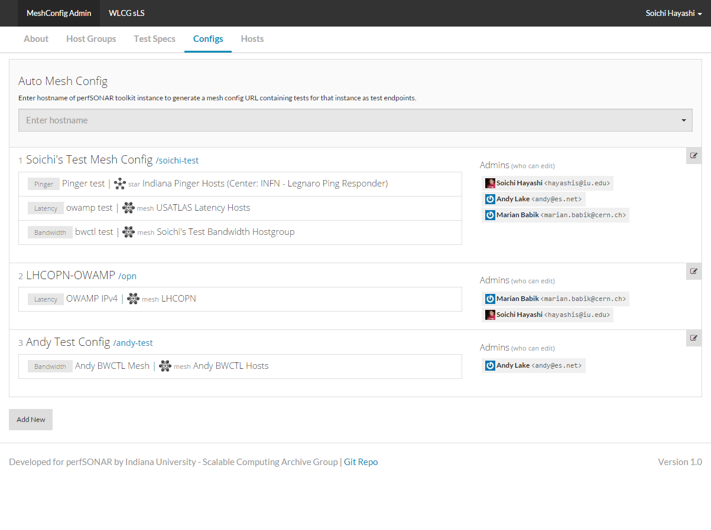

****
MeshConfig Administartor / Publisher
****

.. note:: BETA

MeshConfig Administrator (MCA) is a web UI for toolkit adminitrators to publish MeshConfig which automates tests executed by tookit agent, and provides topology information to various services such as MadDash, OSG/WLCG datastore, and others.

MCA relies on ESNET `Simple Loookup Service <https://github.com/esnet/simple-lookup-service/wiki>`_ to provide a list of hosts that administrator
can select in order to define a mesh. MCA can also load hosts from the Global lookup service if you want to load hosts from the global registry.

MCA allows you to control who has access to various entities that you create; Host Group, Test Spec, MeshConfig, etc.. and some features such as updating MA endpoint for each host are reserved for super-admin.

Contents
#######################

.. toctree::
   :maxdepth: 2

   mca_install
   mca_configure
   mca_userguide
   mca_operation

Please submit bug reports / feature request at `MCA Github Repo <http://github.com/soichih/meshconfig-admin/issues>`_
